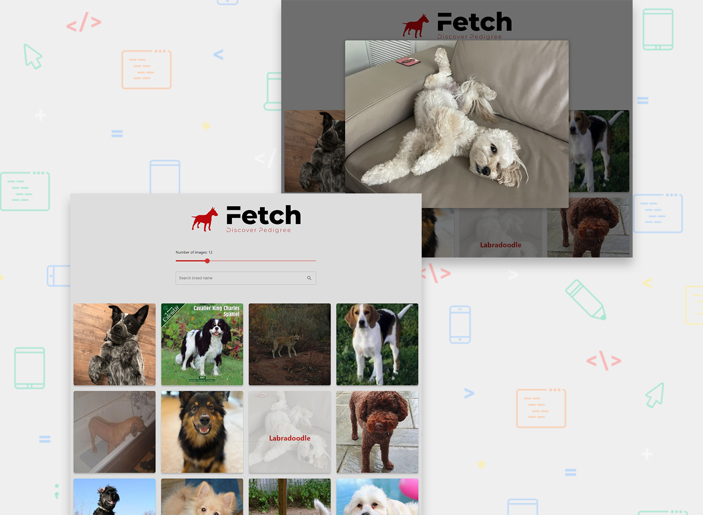
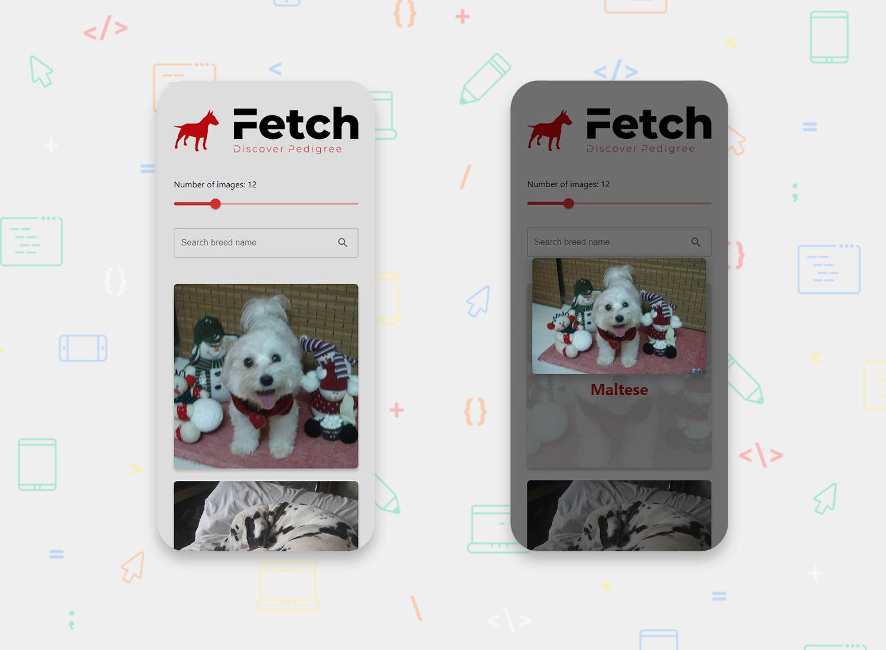

# Dog Breed Search Engine (ReactJS, API)
 
A simple responsive website for searching of dog breeds, utilizing Dog CEO API.

## Table of contents

- [Overview](#overview)
  - [Screenshots](#screenshots)
  - [Links](#links)
- [My process](#my-process)
  - [Built with](#built-with)
  - [Useful resources](#useful-resources)
- [Author](#author)

## Overview

### The challenge

[Specifications.pdf](./Specifications.pdf)

### Screenshots

### Links

- Live Site URL: https://blc7896530-fetch.netlify.app/

## My process

### Built with

- [React](https://reactjs.org/) - JS library
- [MUI](https://mui.com/) - React Library
- Semantic HTML5 markup
- CSS custom properties
- Adobe Photoshop

### Useful resources

- [Dog CEO](https://dog.ceo/) - API utilized for retrieval of dog information.

## Author

- GitHub - https://github.com/brandonlouis
- LinkedIn - [Brandon Louis Chia](www.linkedin.com/in/brandon-louis-chia-63730b162)
