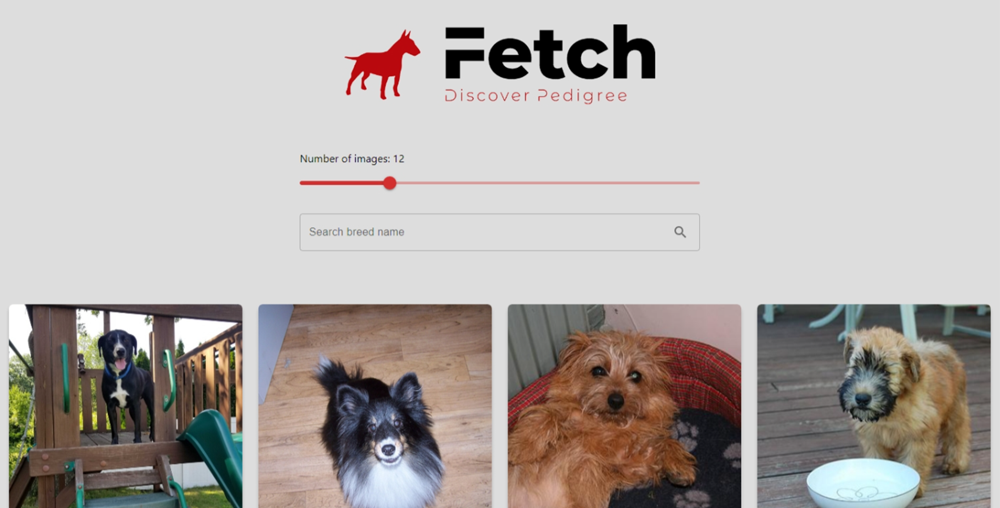

<h1 align="center">Dog Breed Search Engine (ReactJS)</h1>

[Live Site](https://blc7896530-fetch.netlify.app/) | [Specifications](./Specifications.pdf)

A responsive website for searching of dog breeds, utilizing Dog CEO API.

## The challenge

Users should be able to:

- View the optimal layout depending on their device's screen size
- See hover states for all interactive elements on the page
- Search for different dog breeds and adjust the number of results

## Screenshots

## Built with

- [React](https://reactjs.org/) - JS library
- [MUI](https://mui.com/) - React Library
- Semantic HTML5 markup
- CSS custom properties
- Adobe Photoshop

## Useful resources

- [Dog CEO](https://dog.ceo/) - API utilized for retrieval of dog information.

## Author

- GitHub - https://github.com/brandonlouis
- LinkedIn - [Brandon Louis Chia](www.linkedin.com/in/brandon-louis-chia-63730b162)
